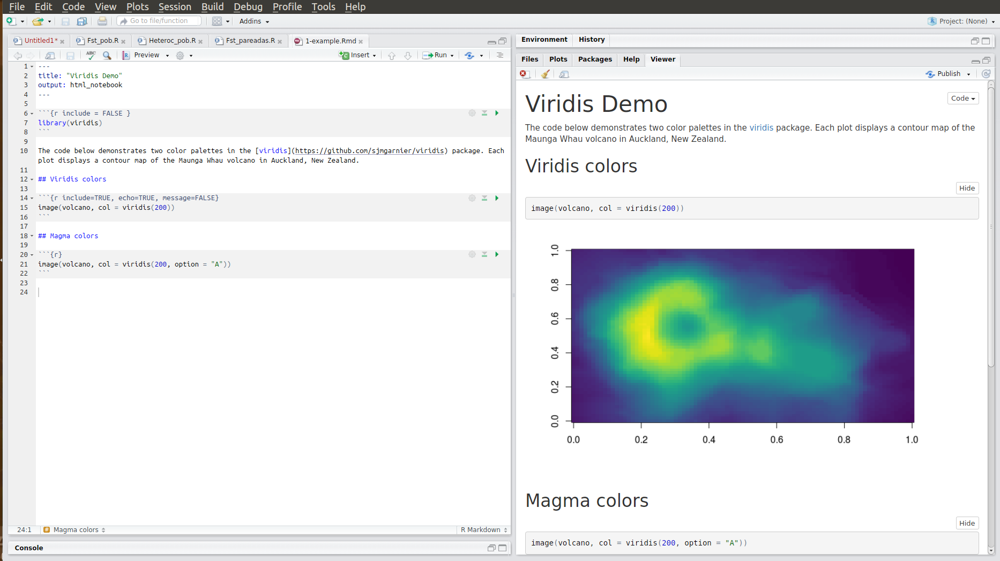
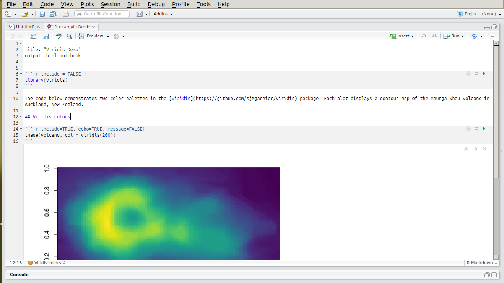
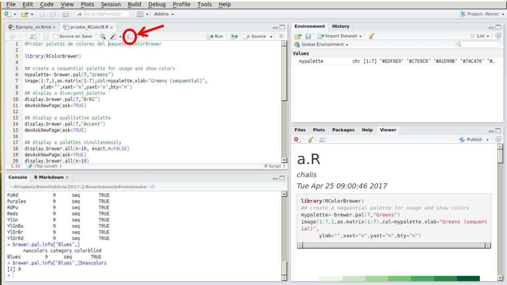

## Introducción a R con un enfoque bioinformático

##  R y RStudio 		

### ¿Qué es R?
* R es un lenguaje de programación y un ambiente de cómputo estadístico
* R es software libre (no dice qué puedes o no hacer con el software), de código abierto (todo el código de R se puede inspeccionar - y se inspecciona).
* Cuando instalamos R, instala la base de R. Mucha de la funcionalidad adicional está en **paquetes** que la comunidad crea.

### ¿Por qué R?
* R funciona en casi todas las plataformas (Mac, Windows, Linux e incluso en Playstation 3).
* R es un lenguaje de programación completo, permite desarrollo de DSLs (funciones muy específicas)
* R promueve la investigación reproducible: no sólo de análisis sino de cómo se hicieron las figuras.
* R está actualizado gracias a que tiene una activa comunidad. Solo en CRAN hay cerca de 8000 paquetes (funcionalidad adicional de R creadas creada por la
comunidad).
* R se puede combinar con herramientas bioinformáticas y formatos de datos procesados (e.g. plink, vcf, etc) para realizar análisis y figuras.
* R tiene capacidades gráficas muy sofisticadas.
* R es popular como herramienta estadística (la guerra del software) y cada vez más también como herramienta bioinformática.


### Descargar R y RStudio
Para comenzar se debe descargar [R](https://cran.r-project.org), esta descarga incluye R básico y un editor de textos para escribir código. Después de descargar R se recomienda descargar [RStudio](https://www.rstudio.com/products/rstudio/download/) (gratis y libre).

**RStudio** es un ambiente de desarrollo integrado para R: incluye una consola, un editor de texto y un conjunto de herramientas para administrar el espacio de trabajo cuando se  utiliza R.


### ¿Cómo entender R?
* Hay una sesión de R corriendo. La consola de R es la interfaz entre R y nosotros.
* En la sesión hay objetos. Todo en R es un objeto: vectores, tablas,  funciones, etc.
* Operamos aplicando funciones a los objetos y creando nuevos objetos.

##### La consola
Es una ventana que nos permite comunicarnos al motor de R. Esta ventana acepta **comandos** en el lenguaje de R y brinda una respuesta (resultado) a dichos comandos.

Por ejemplo, le podemos pedir a R que sume 1+1 así:

```
1+1
```    

La consola se distingue por tener el símbolo `>` seguido de un cursor parpadeante que espera a que le demos instrucciones (cuando recién abrimos R además muestra la versión que tenemos instalada y otra info).

Tu Consola debe verse más o menos así después del ejemplo anterior:


##### Scripts y el editor

Como hemos visto en otras unidades, un **script** es un archivo de nuestros análisis que es:

* un archivo de texto plano
* permanente,
* repetible,
* anotado y
* compartible


En otras palabras, un script es una recopilación por escrito de las instrucciones que queremos enviar a la consola, de modo que al tener esas instrucciones cualquiera pueda repetir el análisis tal cual se hizo.

Un script muy sencillo podría verse así:


"Ejemplo_script.R" es el nombre del archivo, es decir, que este texto es un **archivo de texto** (con terminación .R en vez de .txt) que vive en mi computadora.


RStudio brinda además de la consola un editor de texto, que es la pantalla que se observa en el ejemplo anterior. Lo que escribas en el editor de texto puede "enviarse" a la consola con los shortcuts de abajo o con el ícono correr.

La idea es que en el editor de texto vayas escribiendo los comandos y comentarios de tu **script** hasta que haga exactamente lo que quieras.


### Algunos _shortcuts_ útiles en RStudio son:

**En el editor**  

* command/ctrl + enter: enviar código a la consola  
* ctrl + 2: mover el cursor a la consola

**En la consola**  

* flecha hacia arriba: recuperar comandos pasados  
* ctrl + flecha hacia arriba: búsqueda en los comandos  
* ctrl + 1: mover el cursor al editor  
* ? + nombre de función: ayuda sobre esa función.


## Funciones básicas de R más importantes para bioinformática

### Introducción a R como lenguaje de programación

Antes de pasar a las funciones bionformáticas, veamos la sintaxis básica de R y los principales comandos que aprender.  

Un excelente tutorial para familiarizarse con los comandos de R es [TryR](http://tryr.codeschool.com/).

Imprime dos veces este [Acordeón de R básico](https://www.rstudio.com/wp-content/uploads/2016/10/r-cheat-sheet-3.pdf). Ten uno siempre contigo y otro bajo la almuada para la ósmosis.

* Expresiones matemáticas: `1+1`
* Strings de texto: `"¡Holaaaaa mundo!"`
* Valores lógicos: `1<5`, `2+2 ==5`
* Crear una variable: `x<-5`

* Funciones: son un comando que hace algo específico dentro de R. Ejemplo: `sum()`, `mean()`, `help()`

**Ejercicio**: crea una variable con el logaritmo base 10 de 50 y súmalo a otra variable cuyo valor sea igual a 5.

Vectores:

* vectores `c(5, 4, 6, 7)`, `5:9`
* Acceso a elementos de un vector `[]`

**Ejercicio:** suma el número 2 a todos los números entre 1 y 150.

**Ejercicio** ¿cuántos números son mayores a 20
en el vector -13432:234?

Matrices

* Matrices `matrix(0, 3, 5)`
* Acceso a elementos e una matriz `[ , ]`

Data frames

* Data frame `data.frame(x = c("a", "b", "c"), y = 1:3)`
* Acceso a elementos e una data.frame `[ , ]`, `$`

Para una versión un poco más amplia del anterior resumen veamos estas [notas sobre los tipos de objetos de R básico](Tipos_objetos_baseR.Rmd)

### Trabajar con paquetes y datos externos

##### Acordeón funciones útiles al trabajar con paquetes y archivos de datos

* Funciones de sistema: `list.files`, `getwd`, `setwd`
* Cargar una función: `source`
* Instalar paquetes (sola una vez en cada equipo): `install.packages`.
* Cargar un paquete previamente instalado (cada vez que corramos el script): `library`.
* Cargar a R un archivo de texto con filas y columnas (separado por tabs o comas): `read.delim`.
* "Pegar" texto uno detrás de otro: `paste()` y `paste0()`.

#### Notas sobre cargar librerías:

`install.packages` sirve para instalar un paquete en nuestras máquinas, esto la baja de CRAN u otro servidor y lo instala en R, pero **no lo carga a la sesión activa**.

Una vez que el paquete está instalado, este NO estará cargado en el cerebro de R al menos que utilicemos `library(nombredelpaquete)`. Si tu script utiliza un paquete determinado, es recomendable que estos se carguen en las primeras líneas o al principio de la sección de código que los utilizará.

Sólo carga los paquetes que realmente utilices en un script dado.

#### Notas sobre cargar archivos:
`read.delim` sirve para cargar un archivo de texto con filas y columnas. Revisa su ayuda para determinar que variables utilizar para leerlo si está separado por comas, tabulaciones (tab), espacios o qué.

Además de archivos de filas y columnas, se pueden leer a R todo tipo de archivos, en algunos casos esto se hace con paquetes que crearon funciones específicas para esto. Normalmente se llaman `read.algo`. Por ejemplo la función `read.plink` del paquete snpMatrix.

Cuando utilices `read.delim` o símil, asume que tu WD es donde vive tu script y **utiliza rutas relativas** para navegar hasta el archivo que deseas cargar.

(Para poner triste Alicia preguntar por qué es importante hacer lo anterior).

#### Working directory
Buena práctica recomendada: que tu working directory sea donde sea que viva el script en el que estás trabajando.

Para averiguar cuál es tu WD actual utiliza `getwd()`.

Puedes definir tu WD manualmente con la función `setwd()`, pero OJO: realiza esto en **La Consola**, *NO en tu script*. Neto, porfas.

Una trampa práctica en RStudio para que tu WD sea el lugar donde vive tu script es ir al Menú:

`Session > Set Working Directory > To source file location`

O sease "source file" = tu script activo.

Nota también que si abres RStudio clickeando su ícono, tu WD por default será el home de tu usuario. Sin embargo, si abres RStudio clickeando en un script, el WD default será donde viva dicho script.


**Ejercicio:**
Escribe un script que debe estar guardado en `Prac_Uni7/maices/bin` y llamarse `ExplorandoMaiz.R`, que 1) cargue en R el archivo `Prac_Uni7/maices/meta/maizteocintle_SNP50k_meta_extended.txt` y 2) responda lo siguiente.

(averigua cada punto con comandos de R. Recuerda comentar o tendrás 7 años de mala suerte en el lab)

* ¿Qué tipo de objeto creamos al cargar la base?

* ¿Cómo se ven las primeras 6 líneas del archivo?

* ¿Cuántas muestras hay?

* ¿De cuántos estados se tienen muestras?

* ¿Cuántas muestras fueron colectadas antes de 1980?

* En promedio ¿a qué altitud fueron colectadas las muestras?

* ¿Y a qué altitud máxima y mínima fueron colectadas?

* Crea una nueva df de datos sólo con las muestras de la raza Olotillo

* Crea una nueva df de datos sólo con las muestras de la raza Reventador, Jala y Ancho

* Escribe la matriz anterior a un archivo llamado "submat.cvs" en /meta.


### For loops

Al igual que en bash, en R pueden hacerse for loops, con la siguiente sintaxis:

`for (counter in vector) {commands}`

Ejemplo:

```{r}
for (i in 2:10){
  print(paste(i, "elefantes se columpiaban sobre la tela de una araña"))
}

```

La anterior es la versión más simple de un loop. Para otras opciones (como `while`, `if`, `if else`, `next`) revisa este [tutorial](https://www.datacamp.com/community/tutorials/tutorial-on-loops-in-r).

Los loops son útiles ya que nos permiten reciclar código en vez de repetir lo mismo para difernetes valores. Por ejemplo el loop anterior hace lo mismo que:

```{r}
paste(2, "elefantes se columpiaban sobre la tela de una araña")
paste(3, "elefantes se columpiaban sobre la tela de una araña")
paste(4, "elefantes se columpiaban sobre la tela de una araña")
paste(5, "elefantes se columpiaban sobre la tela de una araña")
paste(6, "elefantes se columpiaban sobre la tela de una araña")
paste(7, "elefantes se columpiaban sobre la tela de una araña")
paste(8, "elefantes se columpiaban sobre la tela de una araña")
paste(9, "elefantes se columpiaban sobre la tela de una araña")
paste(10, "elefantes se columpiaban sobre la tela de una araña")

```


**Ejercicio**

* Escribe un for loop para que divida 35 entre 1:10 e imprima el resultado en la consola.


## R Markdown y R Notebook

[R Markdown](http://rmarkdown.rstudio.com/index.html) es un formato que te permite crear documentos o reportes, en los que al mismo tiempo guardas y ejecutas código.



Primero, instala R Markdown:

```
 install.packages("rmarkdown")
```

Un archivo R Markdown es un archivo de texto plano que debe verse algo así:


El archivo tiene tres tipos de contenido:

- Encabezado (---)
- Código (```)
- Texto simple (Markdown)


### Archivos de salida

A partir de un archivo .Rmd, es posible crear archivos de salida en una gran variedad de formatos, por ejemplo:

- HTML
- Documentos interactivos
- Word
- Diapositivas
- PDF
- Páginas web
- R Notebooks

Checa más formatos de salida [aquí](http://rmarkdown.rstudio.com/formats.html)


### Interfaz notebook y R Notebooks

Cuando abres o creas un archivo .Rmd, la interfaz de RStudio cambia a Notebook. Ahora, puedes ejecutar el código usando las flechas y los resultados se despliegan a continuación del código.



Un [R Notebook](http://rmarkdown.rstudio.com/r_notebooks.html#overview) es un documento R Markdown en el que se pueden ejecutar las líneas de código de forma independiente e interactiva, cuya principal característica es que el output del código de muestra debajo de éste.

Cuando se guarda un notebook .Rmd, también se crea un archivo .nb.html. Este es un archivo HTML que contiene el código y los output resultantes, que puede abrirse en cualquier explorador web y en RStudio.

**Ejercicio:** Haz un R Markdown usando el paquete RColorBrewer. El archivo de salida debe ser un documento Word.

### Generar un reporte de un script .R

Es posible generar un reporte a partir de un script de R, aún cuando no tenga el formato de un archivo R Markdown. Únicamente das click en el cuaderno (Compile report) o Ctrl+Shift+K.




## Manipulación y limpieza de datos en R

La manipulación y la limpieza da datos muchas veces es necesaria antes de poner hacer análisis en R. Aquí trataremos brevemente lo siguientes puntos en [notas aparte]:

* [Reestructura de datos y el principio de los datos limpios](Limpieza_de_datos.Rmd).

* [Estrategia divide-aplica-combina](Divide-aplica-combina.html).


## Graficar en R 		

Los apuntes de esta sección están en [Graficar en R](Graficar_en_R.html) (código y gráficas) y [Graficar en R](Graficar en R.Rmd) (sólo código)
